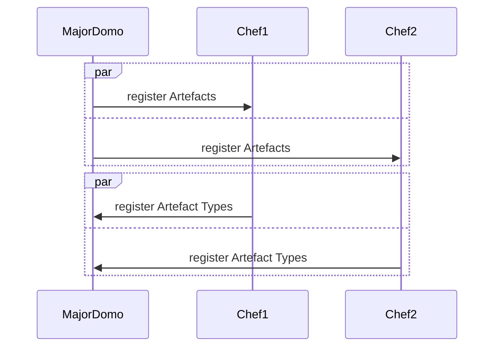
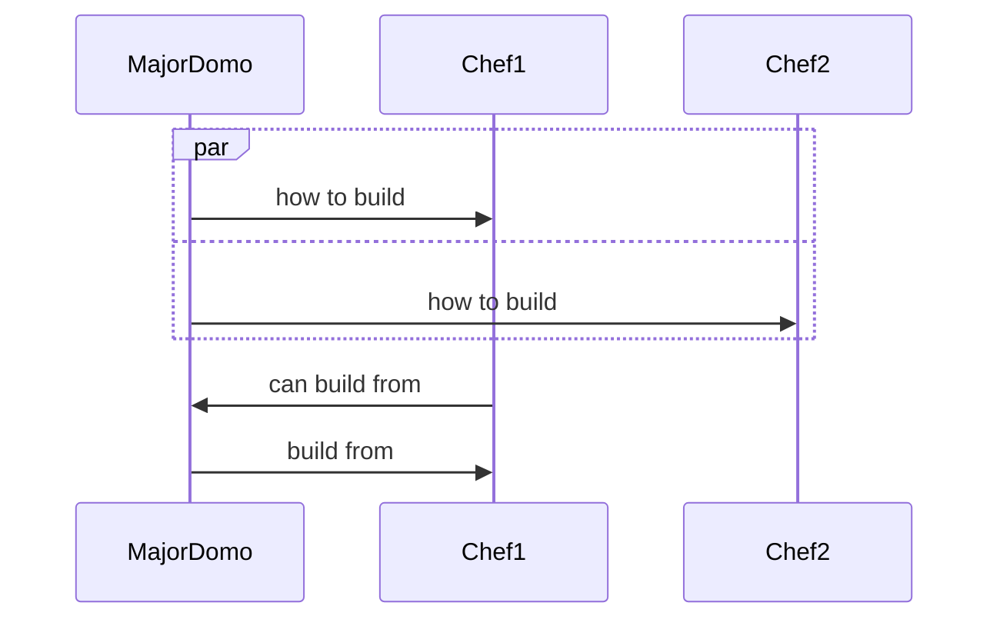

# Build interface (NATS)

The **Build** interface provides a federation of ComputePods the ability
to communicate build requirements between different components.

## Action Sequences

### Registration phase

When a new majorDomo starts up, it broadcasts a "register artefacts"
message to all chefs. These chefs respond with a "register artefact types"
message which registers the artefacts which they know how to use to build
something.

When a new chef starts up, it broadcasts a "register artefact types" to
all running majorDomos.



### Build phase

When a majorDomo wants to (re)build an artefact it begins by broadcasting
a general "how to build" message to all of the chefs. One or more chefs
will respond with details of what and how they might build the artefact.
The majorDomo then responds with a "build from" message directed at the
chosen chef.



## Messages

### Register artefact type

The build Artefact Types

```yaml
natsSubjects:
  registerArtefactType:
    subject: artefact.register.type.<artefactType>
    message: registerArtefactType
```

```yaml
jsonSchemaDefs:
  registerArtefactType:
    type: object
    properties:
      name:
        type: string
      extensions:
        type: array
        items:
          type: string
```

### How to build

```yaml
natsSubjects:
  howToBuild:
   subject: build.howTo.<artefactType>
   message: howToBuild
```

A "how to build" message is a collection of Artefact Types. The "goal"
artefact type represents the type of artefact that the system needs to
learn how to build. The "have" property is a list of artefact types which
the system either has, or knows how to obtain.

The RuleManager component of one or more Chefs is expected to respond with
a "can build from" message, registering the fact that this particular Chef
knows how to build this type of artefact type.

```yaml
jsonSchemaDefs:
  howToBuild:
    type: object
    properties:
      goal:
        type: string
      have:
        type: array
        items:
          type: string
```

### Can build from

```yaml
natsSubjects:
  canBuildFrom:
    subject: build.canFrom.<artefactType>
    message: canBuildFrom
```

A "can build from" message is a collection of Artefact Types. The
"canBuild" artefact type represents the type of artefact that this Chef
knows how to build. The "from" property is a list of artefact types which
are required in the build. The "auxiliaries" property is a list of
artefact types which will be produced *in addition* to the main built
type.

```yaml
jsonSchemaDefs:
  canBuildFrom:
    type: object
    properties:
      canBuild:
        type: string
      from:
        type: array
        items:
          type: string
      auxiliaries:
        type: array
        items:
          type: string
```

### Build

```yaml
natsSubjects:
  buildFrom:
    subject: build.from.<artefactType>
    message: buildDetails
```

```yaml
jsonSchemaDefs:
  buildDetails:
    type: object
    properties:
      build:
        type: string
      from:
        type: array
        items:
          type: string
```
